# LR6
## Лабораторная работа №6 
### 1. Профиль: https://github.com/mrmacgood71

### 2. Сделать копию в личное хранилище из https://github.com/Kurtyanik/LR6/ (Fork)

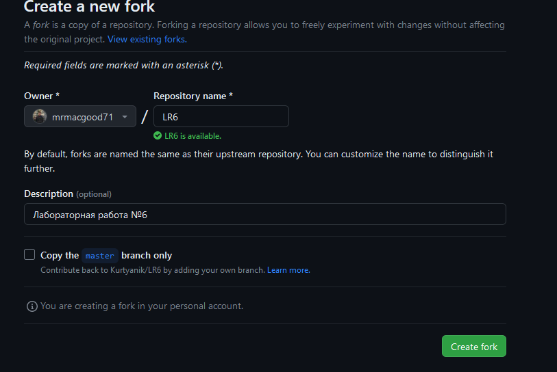

### 3. Установить Git (https://git-scm.com/)
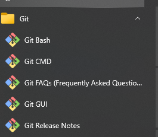

### 4. После установки настроить клиент git, введя имя пользователя (Группа Фамилия И.О.) и email
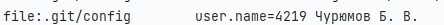
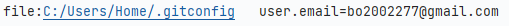

### 5. Клонировать свой личный удалённый репозиторий на компьютер

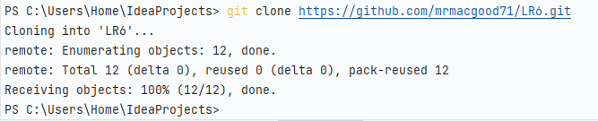

### 6. Добавить файл через интерфейс GitHub. Подтянуть изменения в локальный репозиторий.

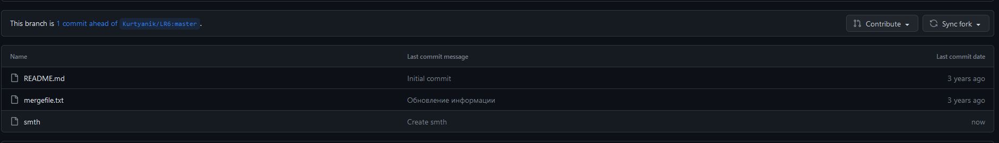
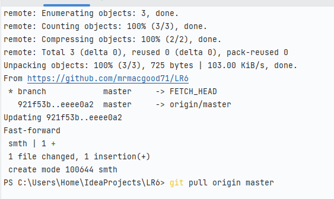

### 7. Получить историю операций для каждой из веток.

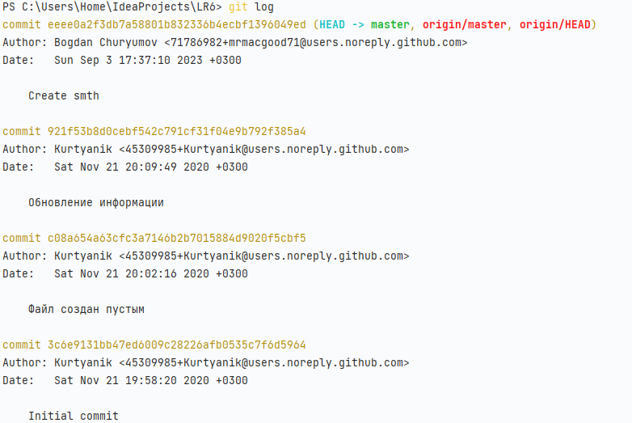
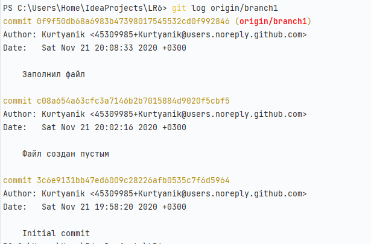

### 8. Просмотреть последние изменения.
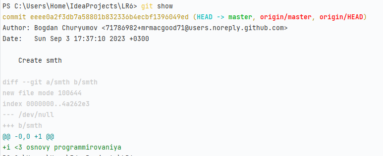

### 9. Выполнить слияние в ветку master, разрешив конфликт (можно использовать специальные редакторы или графический интерфейс git).

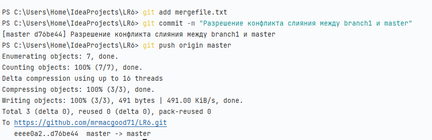
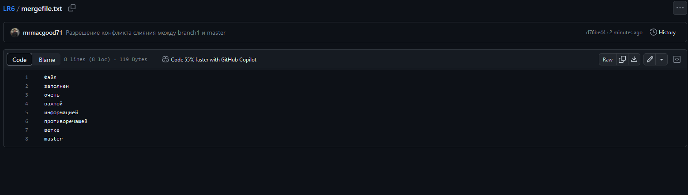

### 10. Удалить побочную ветку после успешного слияния.

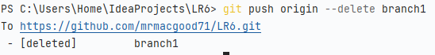

### 11. Сделать изменения и зафиксировать их, оставляя комментарии, несколько раз

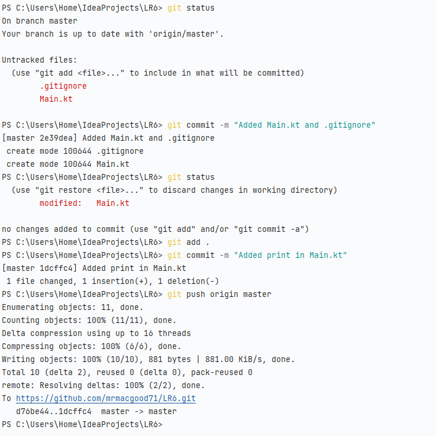

### 12. Сделать откат коммита

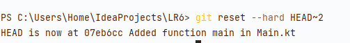
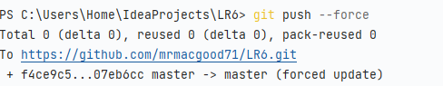

### 13. Создать ветку для отчёта

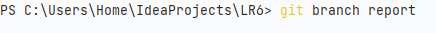
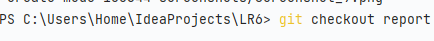

### 14. Начать оформлять отчёт в файле README.md 
### При написании отчёта периодически делать коммиты, не забывать комментировать.

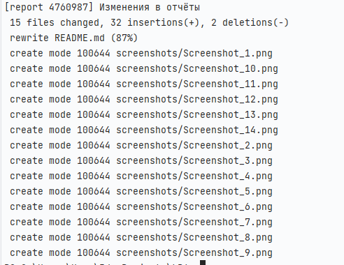

### 15. Получить историю операций в форматированном виде (сокращённый хэш + дата + имя автора + комментарий). Добавить её в отчёт и сделать финальную фиксацию изменений

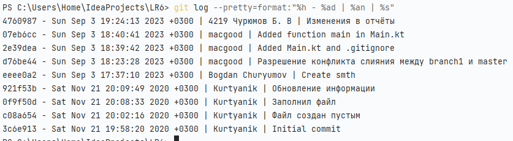
